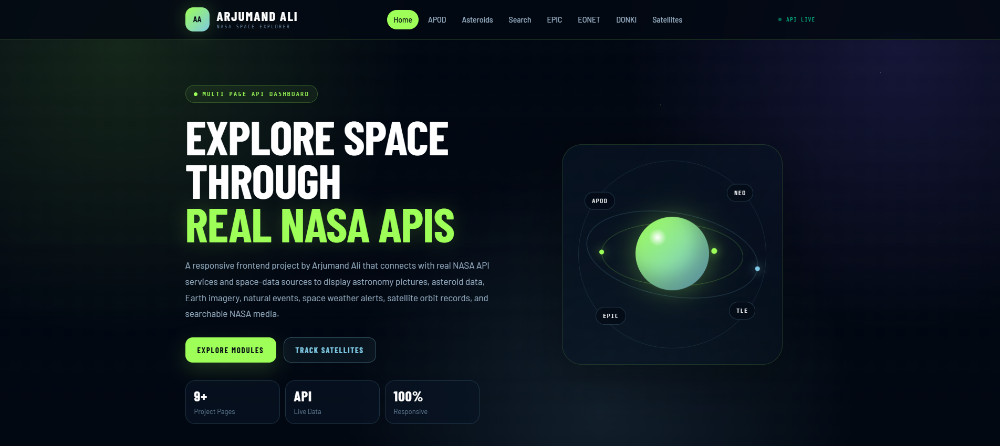

# 🚀 Space API — NASA Space Explorer

<div align="center">


### A modern multi-page JavaScript dashboard using real space APIs, NASA data, satellite orbit records, and responsive frontend design.

<br />

[](#)
[](#)
[](#)
[](#)

<br />

<a href="YOUR_LIVE_DEMO_LINK_HERE" target="_blank">
  
</a>

<a href="https://github.com/arjumand-codes" target="_blank">
  
</a>

</div>

---

## ✨ Overview

**Space API** is a responsive multi-page frontend project built by **Arjumand Ali**.
It connects with real NASA and space-data APIs to display astronomy pictures, asteroid data, Earth imagery, natural events, space weather notifications, satellite orbit records, and searchable NASA media.

This project is built to show practical frontend skills, including API integration, dynamic UI rendering, responsive layouts, loading states, error handling, reusable JavaScript helpers, and localStorage caching.

---

## 🌌 Project Modules

| Module                   | Description                                                                                               |
| ------------------------ | --------------------------------------------------------------------------------------------------------- |
| **APOD**                 | Astronomy Picture of the Day with image/video support, metadata, date picker, random image, and cache.    |
| **Asteroid Tracker**     | Near-Earth object data with speed, miss distance, size estimate, close approach date, and hazard status.  |
| **NASA Image Search**    | Search NASA’s public image and video library without requiring a personal NASA API key.                   |
| **EPIC Earth Images**    | Displays real Earth images captured by NASA’s EPIC camera with image metadata.                            |
| **EONET Natural Events** | Tracks natural Earth events like wildfires, storms, volcanoes, floods, droughts, and snow.                |
| **DONKI Notifications**  | Shows space weather notifications, solar flares, CME events, geomagnetic storms, and solar activity data. |
| **Satellite Tracker**    | Searches satellite TLE orbit records by name or NORAD ID and displays orbit lines.                        |
| **Mars Rover Photos**    | Experimental Mars rover photo module using rover, camera, and Martian sol filters.                        |
| **About Project**        | Project overview, tech stack, modules, and file structure documentation.                                  |

---

## 🔥 Features

* Fully responsive multi-page layout
* Real API integration using `fetch()`
* Clean JavaScript structure with separate files per module
* localStorage caching for faster repeat loading
* Loading skeletons and error states
* Search filters, date filters, dropdown filters, and preset chips
* NASA Image and Video Library search
* Asteroid hazard badges
* Satellite TLE data display
* Animated hero orbit visual
* Modern dark dashboard UI
* Portfolio-ready folder structure

---

## 🛠️ Tech Stack

| Technology       | Purpose                                       |
| ---------------- | --------------------------------------------- |
| **HTML5**        | Semantic page structure                       |
| **CSS3**         | Responsive layout, modern dark UI, animations |
| **JavaScript**   | API requests, DOM rendering, logic, events    |
| **NASA APIs**    | APOD, Asteroids, EPIC, DONKI, Mars Rover data |
| **EONET API**    | Earth natural event tracking                  |
| **TLE Data API** | Satellite orbit records                       |
| **localStorage** | Client-side cache system                      |

---

## 📁 Folder Structure

```txt
space-api/
│
├── index.html
│
├── css/
│   ├── style.css
│   └── responsive.css
│
├── js/
│   ├── config.js
│   ├── helpers.js
│   ├── main.js
│   ├── apod.js
│   ├── mars.js
│   ├── asteroids.js
│   ├── search.js
│   ├── epic.js
│   ├── eonet.js
│   ├── donki.js
│   └── satellites.js
│
└── pages/
    ├── apod.html
    ├── mars.html
    ├── asteroids.html
    ├── search.html
    ├── epic.html
    ├── eonet.html
    ├── donki.html
    ├── satellites.html
    └── about.html
```

---

## ⚙️ API Setup

Open:

```txt
js/config.js
```

Add your NASA API key:

```js
const NASA_API_KEY = "YOUR_NASA_API_KEY";
```

You can generate a NASA API key from the official NASA Open APIs website:

```txt
https://api.nasa.gov/
```

Some pages, like **NASA Image Search** and **EONET**, can work without a personal NASA key.

---

## 🚀 How To Run Locally

Clone the repository:

```bash
git clone https://github.com/arjumand-codes/space-api.git
```

Open the project folder:

```bash
cd space-api
```

Run with any local server. Example using VS Code:

```txt
Right click index.html → Open with Live Server
```

Or simply open:

```txt
index.html
```

in your browser.

---

## 🌐 Deployment

This project can be deployed easily on:

* Vercel
* Netlify
* GitHub Pages

Recommended deployment: **Vercel**

---

## 📸 Preview

Add a screenshot later after deployment:

```md

```

Recommended screenshot path:

```txt
assets/screenshot.png
```

---

## 🎯 What I Learned

While building this project, I practiced:

* Working with multiple API endpoints
* Fetching and rendering JSON data
* Creating reusable JavaScript helper functions
* Handling loading, error, and empty states
* Building responsive dashboard layouts
* Using localStorage for browser cache
* Structuring a professional frontend project
* Creating a portfolio-ready GitHub project

---

## 👨‍💻 Author

**Arjumand Ali**
Front-End & WordPress Developer

* GitHub: [arjumand-codes](https://github.com/arjumand-codes)
* Portfolio: Add your portfolio link here
* LinkedIn: Add your LinkedIn link here

---

## ⭐ Support

If you like this project, give it a star on GitHub.

<div align="center">

### Built with passion by **Arjumand Ali**


</div>
